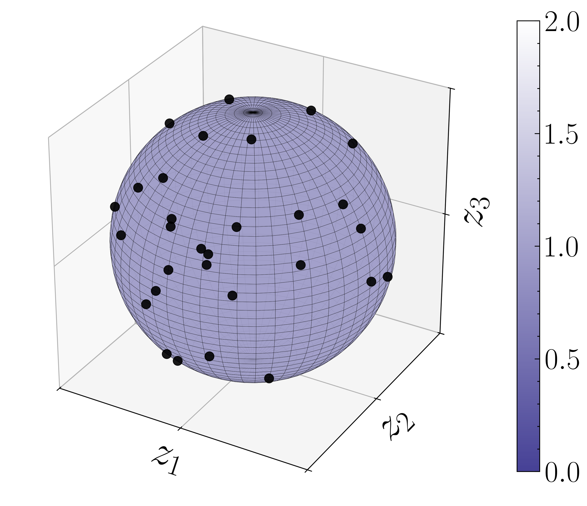
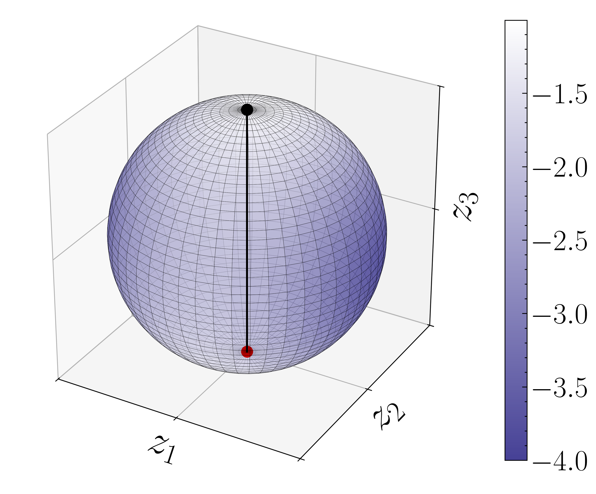

<p align="middle">
    
    
    
    
<p/>

# Transformer Dynamics

The code in this repository reproduces the experiments in the paper "Analysis of mean-field models arising from self-attention dynamics in transformer architectures with layer normalization" by Martin Burger, Samira Kabri, Yury Korolev, Tim Roith, and Lukas Weigand.

## Installation and Usage

The code is written in Python, where the main functionality is structured as a package. In order to install the package in a Python environment, you can clone this repository and run the following command in the root directory of the repository:

```bash
pip install .
```

The package is then then available as ```tfdy```.

## Experiments

The code that produces the figures and results in the paper is located in the ```exps``` directors. In the following we give a brief overview of where to find the code for each experiment.

### Maximizers for positive definite matrices

* ```exps/max_on_sphere.py```: This files contains the code for Figure 1 in the paper. It illustrates the maximizers for poisitve definite matrices in $n=3$ dimensions.`

<p align="middle">
    
    
<p/>


* ```exps\max_on_sphere_split.py```: This file produces the results that were used for Figure 2 in the paper. The result is stored as a ```.csv``` file, where the actual figure was produced via LaTeX in the paper. 

* ```exps\max_on_circle_split_vis.py```: This file produces the illustrative circles on the right side of Figure 2 in the paper. 

<p align="middle">
    
    
    
<p/>


### Minimizers for positive (semi-) definite matrices

* ```exps\min_on_sphere.py```: This file produces the results for Figure 3 in the paper. It illustrates the minimizers for positive (semi-) definite matrices in $n=3$ dimensions.

<p align="middle">
    
    
    
    
<p/>

* ```four_part_system```: This file produces the results for Figure 4 in the paper. We consider a four particle system and show that the final state the system converges to, has the form derived in the paper. The results are stored to ```results/tanh_min<tau>.csv```, where ```<tau>``` is the value of the parameter $\tau$ used in the simulation. The actual figure was produced via LaTeX in the paper. Furthermore, the end of the file is used to produce the illustrative circles on the right side of Figure 4 in the paper.

<p align="middle">
    
    
    
    
<p/>

* ```exps\min_density.py```: This file produces the results for Figure 5 in the paper. Here, we aim to approximate the optimal density function that minimizes the energy functional. Furthermore, here we also compute the error of this approximation to the first order Ansatz and the conjectured guess.


* ```exps\min_density_opt_f.py```: This file optimizes the function $\Upsilon$ in the guesses density function.

### Maximizers for negative definite and indefinite matrices

* ```exps\max_on_sphere_nd.py```: This file produces the results for Figure 6 in the paper. It illustrates the maximizers for negative definite matrices in $n=3$ dimensions.

<p align="middle">
    
    
<p/>

* ```exps\max_on_sphere_id.py```: This file produces the illustration in Figure 7 in the paper. It shows the energies for certain particle states when varying the matrix $D$. The results are stored to the file ```maxid.csv```, where the actual figure was produced via LaTeX in the paper. 